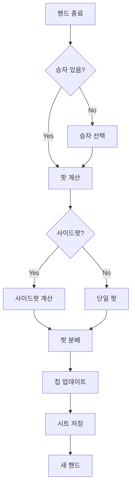

# 승자 결정 및 칩 분배 프로세스 개선 계획

## 🎯 현재 문제점

1. **스트리트 기본값**: preflop으로 시작 → river가 더 실용적
2. **Check/Call 버튼 레이블**: 현재 "Check"만 표시 → 혼란
3. **승자 팟 분배 없음**: 승자 선택해도 칩 변화 없음
4. **승자 결정 프로세스 부재**: 단순 선택만 가능

## 📋 개선 방안

### 1. 승자 결정 프로세스

#### Option A: 단일 승자 (Simple)
```javascript
function distributePotsToWinner(winner) {
  const totalPot = calculatePotSize();
  const player = state.playersInHand.find(p => p.name === winner);
  
  if (player) {
    const currentChips = parseInt(unformatNumber(player.chips) || 0);
    player.chips = (currentChips + totalPot).toString();
    player.chipsUpdatedAt = new Date().toISOString();
    
    // 시각적 피드백
    showFeedback(`${winner}가 ${formatNumber(totalPot)} 칩 획득!`);
  }
}
```

#### Option B: 다중 승자 & 사이드팟 (Advanced)
```javascript
function distributePotsWithSidePots() {
  const { pots, contributions } = calculateSidePots();
  const winners = state.playersInHand.filter(p => p.role === 'winner');
  
  if (winners.length === 0) {
    showFeedback('승자를 선택해주세요', true);
    return;
  }
  
  // 각 팟별로 분배
  pots.forEach(pot => {
    // 해당 팟에 참여한 승자들
    const potWinners = winners.filter(w => 
      pot.players.includes(w.name)
    );
    
    if (potWinners.length > 0) {
      const share = Math.floor(pot.amount / potWinners.length);
      const remainder = pot.amount % potWinners.length;
      
      potWinners.forEach((winner, idx) => {
        const chips = parseInt(unformatNumber(winner.chips) || 0);
        const winAmount = share + (idx === 0 ? remainder : 0);
        winner.chips = (chips + winAmount).toString();
        winner.chipsUpdatedAt = new Date().toISOString();
      });
    }
  });
  
  // 결과 표시
  displayWinnerResults();
}
```

### 2. 승자 선택 UI 개선

#### 현재
```html
<button>Player A</button>
<button>Player B</button>
```

#### 개선안
```html
<!-- 단일 승자 모드 -->
<div class="winner-selection-mode">
  <button class="mode-toggle">
    <span>단일 승자</span> | <span>스플릿</span>
  </button>
</div>

<!-- 승자 버튼 -->
<button data-player="A">
  Player A
  <span class="win-amount">+1,250</span>
</button>

<!-- 팟 분배 버튼 -->
<button id="distribute-pot-btn" class="bg-green-600">
  팟 분배 실행
</button>
```

### 3. 전체 플로우



### 4. 구현 코드

#### 스트리트 기본값 변경
```javascript
// 현재
state.currentStreet = 'preflop';

// 개선
state.currentStreet = 'river'; // 실무에서 더 자주 사용
```

#### Check/Call 버튼 레이블
```javascript
// 현재
<span class="action-label">Check</span>

// 개선
function getSmartButtonLabel(player, street) {
  const action = getSmartCheckCallAction(player, street);
  if (action.action === 'Checks') {
    return 'Check';
  } else if (action.action === 'Calls') {
    return `Call ${formatNumber(action.amount)}`;
  } else if (action.action === 'All In') {
    return `All-in ${formatNumber(action.amount)}`;
  }
  return 'Check/Call';
}
```

#### 승자 팟 분배
```javascript
function handleWinnerSelection() {
  const winners = state.playersInHand.filter(p => p.role === 'winner');
  
  if (winners.length === 0) {
    showFeedback('승자를 선택해주세요', true);
    return false;
  }
  
  // 팟 계산
  const totalPot = calculatePotSize();
  const hasSidePots = state.playersInHand.some(p => 
    state.playerStatus[p.name] === 'allin'
  );
  
  if (hasSidePots) {
    // 사이드팟 분배
    return distributeSidePots(winners);
  } else {
    // 단순 분배
    return distributeSimplePot(winners, totalPot);
  }
}

function distributeSimplePot(winners, totalPot) {
  const share = Math.floor(totalPot / winners.length);
  const remainder = totalPot % winners.length;
  
  winners.forEach((winner, idx) => {
    const currentChips = parseInt(unformatNumber(winner.chips) || 0);
    const winAmount = share + (idx === 0 ? remainder : 0);
    
    // 칩 업데이트
    winner.chips = (currentChips + winAmount).toString();
    winner.chipsUpdatedAt = new Date().toISOString();
    winner.winAmount = winAmount; // 표시용
  });
  
  // 결과 표시
  const winnerNames = winners.map(w => 
    `${w.name} (+${formatNumber(w.winAmount)})`
  ).join(', ');
  
  showFeedback(`승자: ${winnerNames}`);
  return true;
}
```

### 5. 시트 전송 시 최종 칩 반영

```javascript
function buildTypeUpdates() {
  return state.playersInHand
    .filter(p => p.chipsUpdatedAt) 
    .map(p => ({
      player: p.name,
      table: state.selectedTable,
      chips: String(p.chips || ''), // 승자 보상 포함된 최종 칩
      updatedAt: p.chipsUpdatedAt,
      lastResult: p.role === 'winner' ? 'W' : 'L' // 승패 기록
    }));
}
```

## 🚀 구현 우선순위

### Phase 1 (즉시 적용)
1. ✅ 스트리트 기본값 river로 변경
2. ✅ Check/Call 버튼 레이블 동적 변경
3. ✅ 단순 팟 분배 (단일 승자)

### Phase 2 (다음 단계)
1. 스플릿 팟 지원
2. 사이드팟 자동 분배
3. 승자 히스토리 기록

### Phase 3 (고급 기능)
1. 핸드 랭킹 자동 판정
2. 하이/로우 스플릿
3. 팟 분배 애니메이션

## 📝 테스트 시나리오

### 시나리오 1: 단일 승자
```
Pot: 1000
Winner: Player A (chips: 500)
Result: Player A chips = 1500
```

### 시나리오 2: 스플릿 팟
```
Pot: 1000
Winners: Player A, Player B
Result: Each gets 500
```

### 시나리오 3: 사이드팟
```
Main Pot: 300 (A, B, C)
Side Pot: 200 (B, C)
Winner: Player B
Result: B gets 500, A/C get 0
```